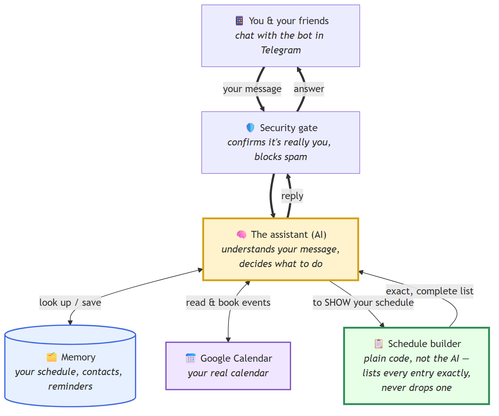

# How MeetSync works (plain-English guide)

MeetSync is a friendly assistant that lives inside **Telegram**. You chat with it like a person — "what's my schedule?", "book dinner with Marco on Friday", "I've got a doctor's appointment Wednesday at 3" — and it keeps track of everything and helps you and your friends find time to meet.

Here's the whole thing in one picture:

## The parts, in everyday terms

| Part | Think of it as… | What it does |
|---|---|---|
| 📱 **You & your friends** | The people | Everyone just chats with the bot in Telegram. No app to install. |
| 🛡️ **Security gate** | The front desk / bouncer | Makes sure the message is really from you and not spam, before anything else happens. |
| 🧠 **The assistant (AI)** | A smart personal assistant | Reads your message, works out what you want, and decides what to do — save an event, find a free slot, answer a question. |
| 🗂️ **Memory** | A filing cabinet | Remembers your schedule, your contacts, and your reminders so nothing's lost between chats. |
| 📅 **Google Calendar** | Your real calendar | When a meetup is agreed, it puts the event on your actual calendar (and invites people if needed). |
| 📋 **Schedule builder** | A printer that never skips a line | When you ask to *see* your schedule, this lays it out — and it's plain, predictable code, **not** the AI guessing. |

## What happens when you type "Schedule"

1. Your message goes through the **security gate** (quick "yep, that's really you" check).
2. The **assistant** sees you want to see your schedule.
3. It hands the job to the **schedule builder**, which pulls **every** entry from memory and lays them out in order.
4. That exact list is sent straight back to you in Telegram.

The assistant doesn't *retype* your schedule from memory — it just asks the builder to print it. That's the key to it being trustworthy.

## Why it won't "forget" your stuff anymore

Earlier, the bot used to write out your schedule from its own head each time — and occasionally it would drop a line (that's the "where's the cooking with Fran?" moment). 

Now the schedule you see is **built by plain code**, not the AI. That means an entry **physically can't go missing** from the list — it's not "less likely", it's not possible. The AI is still the clever bit that understands you and makes decisions, but the part that *shows you your life back* is now boringly reliable on purpose.

Private things (like medical or mental-health appointments) are shown as a discreet "G appointment" / "P appointment" — enough for **you** to recognise them, but safe to show on screen if you share your schedule with someone.

---
*Diagram source: `how-meetsync-works.svg` (vector, scales cleanly) and `how-meetsync-works.png` (image). Regenerate with: `npx @mermaid-js/mermaid-cli -i how-meetsync-works.mmd -o how-meetsync-works.png`.*
